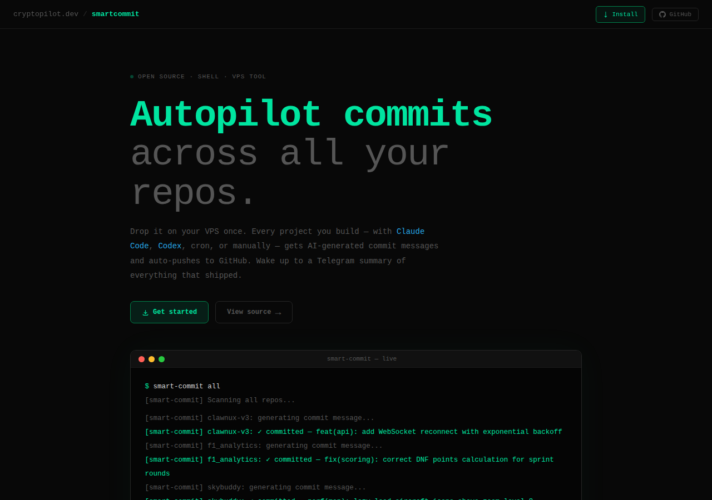

# 🔁 Smart-Commit

Autopilot commits across all your repos.

🌐 **[cryptopilot.dev/smartcommits](https://cryptopilot.dev/smartcommits)**



## What it does

- **Detects dirty repos** across all projects under `$HOME`
- **Generates meaningful commit messages** using local Ollama (llama3.1:8b) — no API costs
- **Auto-creates GitHub repos** for new projects and wires remotes with auth
- **Skips clean repos** — no empty commits, no noise
- **Tags commit source** — know if a commit came from Claude Code, Codex, cron, or manual
- **Logs everything** to JSONL for analytics
- **Daily & weekly Telegram rollups** — wake up to a summary of what shipped
- **Git hooks** — even manual commits get logged to the system
- **Auto preview screenshots** — weekly cron retakes landing page screenshots, only commits if the page actually changed
- **Smart exclusions** — ignores backup dirs, `.codex/.tmp`, `node_modules`, and other noise

## Architecture

```
┌─────────────────┐  ┌──────────────┐  ┌──────────────┐
│  Claude Code    │  │    Codex     │  │  Cron (2h)   │
│  post-task hook │  │  post-task   │  │  auto-sweep  │
└────────┬────────┘  └──────┬───────┘  └──────┬───────┘
         │                  │                  │
         └──────────────────┼──────────────────┘
                            │
                   ┌────────▼────────┐
                   │  smart-commit   │
                   │    engine       │
                   └────────┬────────┘
                            │
              ┌─────────────┼─────────────┐
              │             │             │
       ┌──────▼──────┐ ┌───▼────┐ ┌──────▼──────┐
       │ Ollama LLM  │ │  Git   │ │  Telegram   │
       │ commit msg  │ │ commit │ │  rollup     │
       └─────────────┘ └────────┘ └─────────────┘
```

## Commands

```bash
smart-commit discover              # List all repos and their status
smart-commit status                # System overview with commit counts
smart-commit all [source]          # Commit all dirty repos
smart-commit commit [path] [source] [msg]  # Commit specific repo
smart-commit rollup                # Send daily Telegram summary
smart-commit weekly                # Send weekly Telegram summary
```

## Sources

| Source | When |
|--------|------|
| `auto` | Cron job sweep (default) |
| `claude-code` | Claude Code task completion |
| `codex` | Codex task completion |
| `manual` | You ran it yourself |
| `direct` | Git hook caught a manual `git commit` |

## Setup

```bash
# 1. Clone and run the installer
git clone https://github.com/CryptoPilot16/smartcommit /opt/smartcommit
bash /opt/smartcommit/install.sh

# 2. Edit env file with your credentials
nano ~/smart-commit/.env
# TELEGRAM_BOT_TOKEN=
# TELEGRAM_CHAT_ID=
# GITHUB_TOKEN=
# GITHUB_USERNAME=
# OLLAMA_MODEL=llama3.1:8b

# 3. Test
smart-commit discover
smart-commit status
smart-commit all
```

## Telegram Notifications

| When | What |
|------|------|
| After every sweep (if commits made) | 🔄 X repos updated |
| When a new repo is auto-created | 🆕 New repo created on GitHub |
| 23:55 UTC daily | 📊 Daily commit rollup |
| Monday 08:00 UTC | 📅 Weekly commit rollup |

## Cron Schedule

| When | What |
|------|------|
| Every hour | Wire new repos, create GitHub repos, embed auth |
| Every 2 hours | Auto-commit all dirty repos |
| 23:55 UTC daily | Daily Telegram rollup |
| Monday 08:00 UTC | Weekly Telegram rollup |
| Sunday 03:00 UTC | Retake landing page screenshots (if page changed) |

## Repo Discovery

Smart-commit scans `$HOME` up to 4 levels deep for git repos. The following are automatically excluded:

- `.openclaw-backup/`, `.openclaw.pre-revert-*/` — internal backups
- `.codex/.tmp/` — Codex temp workspaces
- `node_modules/` — dependencies

## Requirements

- [Ollama](https://ollama.ai) with `llama3.1:8b` (or any model via `OLLAMA_MODEL`)
- GitHub personal access token with `repo` scope
- Telegram bot token + chat ID
